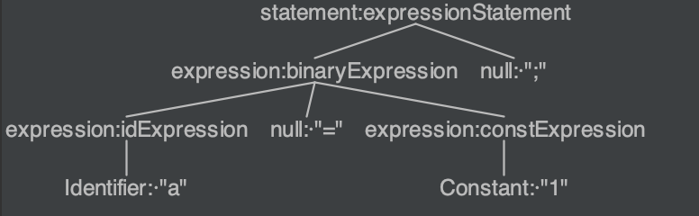
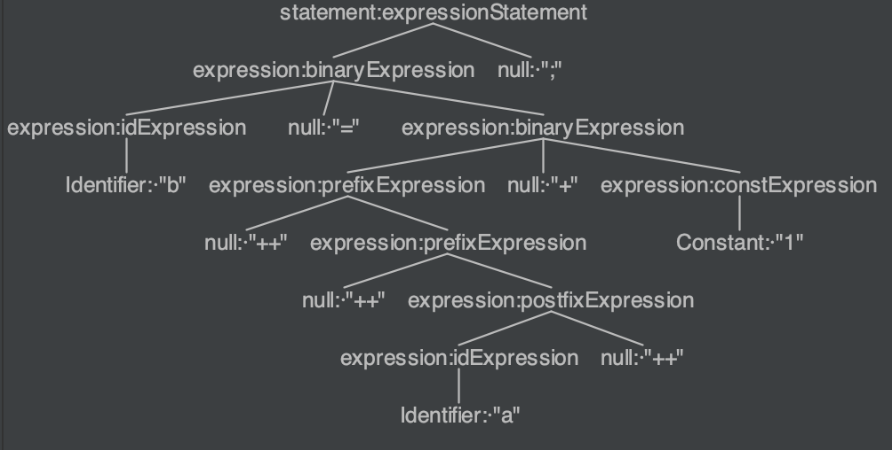
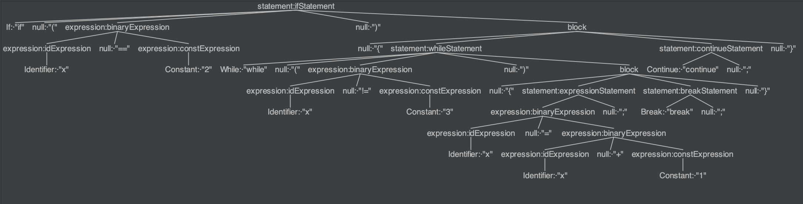

### Get Start

提交你的compiler repo的git链接（public）

[cmd2001/mx-compiler](https://github.com/cmd2001/mx-compiler)

### g4 Grammar

如果你要使用antlr4，在你的Compiler repo中添加对应的`g4`文件，并给出其路径

1. 给出你定义的语法如何Parse下述两个statement（即只需要给出以statement为root的subtree）：
   1. `a = 1;`
   
      
   
   2. `b = ++++a++ + 1;`
   
      
   
2. 在g4中如何区别`a++`/`a--`和`++a`/`--a`；

   `a++/a--`:

   ```antlr
   expression op=('++' | '--')
   ```
   
   `++a/--a`：
   
   ```
   <assoc=right> op=('++' | '--') expression
   ```
   
3. 对于以下三种文法，其生成的Antlr代码的`AContext.b()`的返回类型是？
   1. `a: b`
   
      `BContext`
   
   2. `a: b*`
   
      `List<BContext>`
   
   3. `a: b C b`
   
      `List<BContext>`

### AST Node
1. 描述以下代码的AST节点结构：
```cpp
if (x == 2){
	while(x != 3){
		x = x + 1;
		break;
	}
	continue;
}
```



2. 简述 `Statement`和`Expression` 的设计关系

`statement`包含`expression` `')'`和其他内容。

